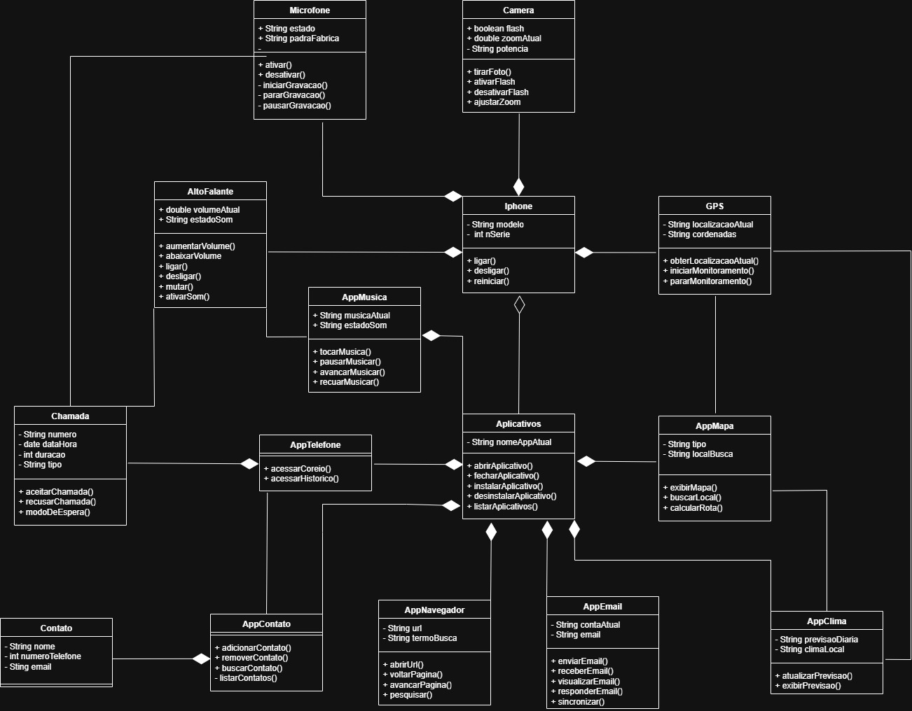

# 📱 Diagrama UML – iPhone 2007

## 📌 Descrição

Este projeto apresenta um **Diagrama de Classes UML** inspirado no lançamento do primeiro iPhone (2007), conforme demonstrado por Steve Jobs. O objetivo é modelar de forma orientada a objetos os principais **componentes físicos** e **aplicações** que faziam parte do dispositivo original, representando a integração de hardware e software em um único aparelho.

---

## 📷 Imagem do Diagrama

>   
> *(Clique para ampliar)*

---

## 📦 Estrutura do Diagrama

### 🔧 Componentes de Hardware
- **Microfone**: ativa, desativa, grava e pausa.
- **Câmera**: tira fotos, ativa/desativa flash, zoom.
- **Alto-Falante**: controle de volume, som.
- **GPS**: localização e monitoramento.

### 🧩 Aplicativos
Representados por uma classe base (`Aplicativos`), com especializações:
- **AppTelefone**: faz chamadas, acessa correio de voz.
- **AppContato**: adiciona, busca e remove contatos.
- **AppEmail**: envia, recebe e sincroniza e-mails.
- **AppNavegador**: navegação por páginas da web.
- **AppMusica**: controle de reprodução de música.
- **AppClima**: previsão do tempo.
- **AppMapa**: exibe mapas e calcula rotas.

### ☎️ Chamada
Classe que representa ligações realizadas, recusadas ou em espera.

### 👤 Contato
Entidade com nome, número e e-mail. Usada pelo `AppContato`.

---

## ⚙️ Tecnologias Usadas

- [draw.io / diagrams.net](https://draw.io): criação visual do diagrama
- UML (Unified Modeling Language): linguagem de modelagem de software

